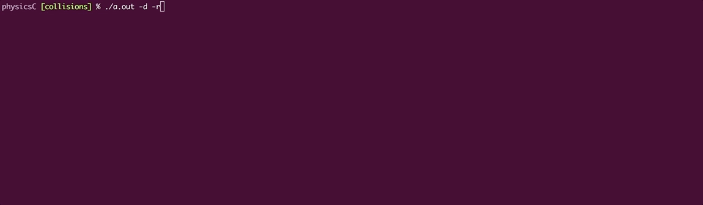
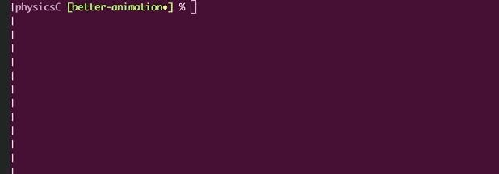
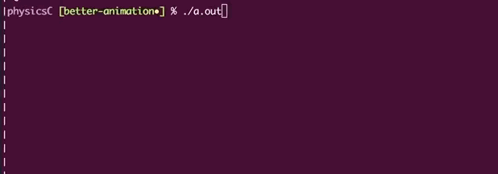
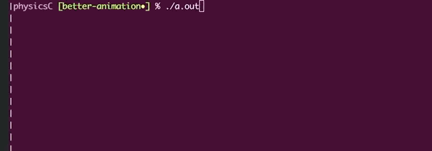

### physicsC
A cellular automata-inspired low-rez discrete event simulation with absolutely no collision detection!
#
_Note: this project was intended it primarily as a way to learn some of the basics of C. \
To say it has anything to do with physics is quite a joke._
#

#

#

#

#

